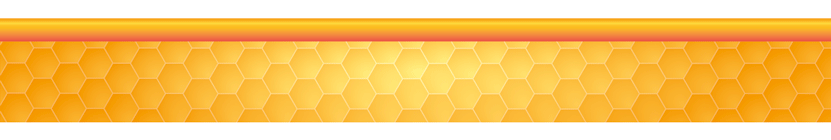

---
title: "Estadísticas"
---   

```{r setup, include=FALSE}
knitr::opts_chunk$set(echo = TRUE)
```


<div class=text-justify>


```{r i_4x, fig.align='center', echo=FALSE, cache=TRUE}



```

Temporalmente fuera de servicio por mantenimiento